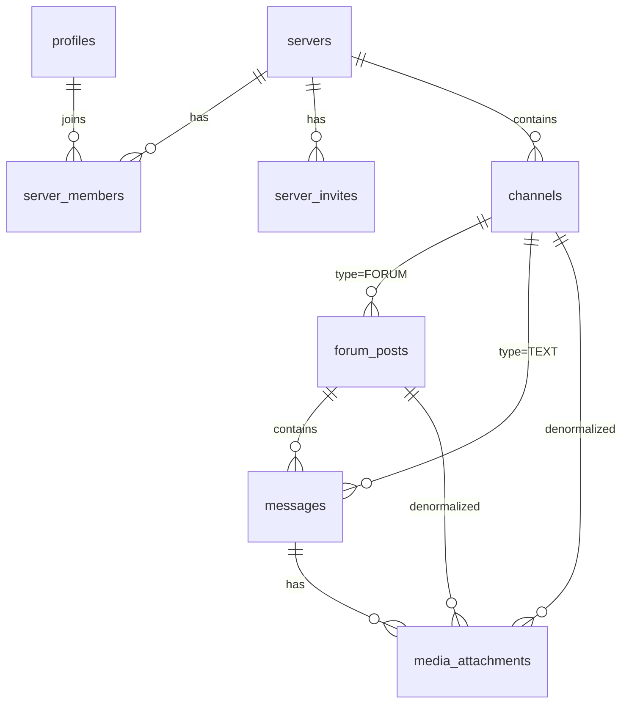

# GoonRoom — Architecture

## Overview
GoonRoom is a self-hosted Discord-style workspace with multi-server support, real-time text channels, and forum channels with threaded posts and media galleries. All media is stored on a self-hosted MinIO S3-compatible server. The entire stack runs on a single Intel NUC (i7, 16 GB RAM, 10-Gigabit connection) via Docker.

---

## Tech Stack

| Layer         | Technology                                         |
|---------------|---------------------------------------------------|
| Frontend      | Next.js (App Router), React 19, TypeScript        |
| Styling       | Tailwind CSS v4, shadcn/ui, Lucide Icons           |
| Animation     | Framer Motion                                      |
| Database/Auth | Supabase (PostgreSQL), RLS enabled on all tables  |
| Realtime      | Supabase Realtime (WebSocket subscriptions)        |
| Storage       | Self-hosted MinIO (S3-compatible)                  |
| S3 SDK        | @aws-sdk/client-s3, @aws-sdk/s3-request-presigner |
| Deployment    | Docker (self-hosted on Intel NUC), Cloudflare Tunnels (public access) |
| Validation    | Zod                                                |

---

## Deployment Topology

Next.js and MinIO run as sibling containers on the same Docker host (Intel NUC), connected via a shared bridge network (`goonroom-net`). Cloudflare Tunnels expose both services to the public internet.

### Dual-Network S3 Routing

S3 operations use two distinct network paths depending on the caller:

| Caller | Endpoint env var | Value | Network |
|--------|-----------------|-------|---------|
| Next.js server (bucket ops, listing, deleting) | `MINIO_ENDPOINT` | `http://minio:9000` | Internal Docker bridge — near-zero latency |
| Presigned URL generation (runs server-side, URL consumed by browser) | `MINIO_PUBLIC_URL` | `https://s3.yourdomain.com` | Signed against the public host so the browser signature matches |
| Browser (upload PUT, media viewing) | `MINIO_PUBLIC_URL` | `https://s3.yourdomain.com` | Public internet via Cloudflare Tunnel |

`src/lib/s3.ts` maintains two S3 clients: an internal client (`MINIO_ENDPOINT`) for server-only operations and a public client (`MINIO_PUBLIC_URL`) for generating presigned URLs. Browser-facing `file_url` values are also built from `MINIO_PUBLIC_URL`. These must always be two separate env vars.

### Network Flow

```
┌──────────────── Intel NUC (Docker Host) ─────────────────┐
│                                                           │
│  ┌──────────┐  goonroom-net  ┌──────────┐                │
│  │ Next.js  │◄──────────────►│  MinIO   │                │
│  │ :3000    │  http://minio  │ :9000    │                │
│  └────┬─────┘    :9000       └────┬─────┘                │
│       │ localhost:3000            │ localhost:9000/9001   │
│       │                           │                       │
│  ┌────┴───────────────────────────┴────┐                  │
│  │        cloudflared (host service)   │                  │
│  └────┬───────────────────────────┬────┘                  │
└───────┼───────────────────────────┼───────────────────────┘
        │                           │
   Cloudflare                  Cloudflare
    Tunnel                      Tunnel
        │                           │
   goonroom.              s3.gayniggasex.com
   gayniggasex.com         console.s3.gayniggasex.com
        │                           │
   ┌────┴───────────────────────────┴────┐
   │            Browser / Client         │
   └─────────────────────────────────────┘
```

### Docker Compose Services

| Service   | Image                     | Port(s)   | Purpose                              |
|-----------|---------------------------|-----------|--------------------------------------|
| `nextjs`  | `goonroom-nextjs` (built) | 3000      | Next.js standalone production server |
| `minio`   | `minio/minio:latest`      | 9000/9001 | S3-compatible storage (API / Console)|

Both services are on a shared `goonroom-net` bridge network. Ports are mapped to the host so the existing host-level `cloudflared` service can reach them.

### Cloudflare Tunnel

`cloudflared` runs as a system service on the NUC (not inside Docker). Public hostname mappings are configured in the CF Zero Trust dashboard (Networks → Tunnels → Public Hostnames):

| Public hostname                  | Service target          |
|----------------------------------|-------------------------|
| `goonroom.gayniggasex.com`       | `http://localhost:3000` |
| `s3.gayniggasex.com`             | `http://localhost:9000` |
| `console.s3.gayniggasex.com`     | `http://localhost:9001` |

### Constraints

- **No payload limits.** Self-hosted, so Vercel's 4.5 MB serverless payload limit and 10-second timeout do not apply.
- **Pre-signed URLs are still mandatory** for media uploads. Direct browser-to-S3 uploads keep the Next.js process free for serving requests and avoid buffering large files through Node.js.
- **Standalone output.** Next.js is built with `output: 'standalone'` for a minimal Docker image (~304 MB). Static assets and `public/` are copied separately in the Dockerfile.
- **Build-time env vars.** `NEXT_PUBLIC_SUPABASE_URL` and `NEXT_PUBLIC_SUPABASE_ANON_KEY` must be passed as build args because Next.js inlines them into the client bundle.

---

## Supabase Project
- **Project ID:** `enoszpjrvhvbjvzvumjs`
- **Region:** us-east-1
- **URL:** `https://enoszpjrvhvbjvzvumjs.supabase.co`

---

## Database Schema

### Entity Relationships



### `profiles`
Extends `auth.users`. Auto-created via trigger on signup.
| Column       | Type        | Notes                    |
|-------------|-------------|--------------------------|
| id          | uuid (PK)   | References auth.users    |
| username    | text        | Unique                   |
| avatar_url  | text        | Nullable                 |
| created_at  | timestamptz |                          |

### `servers`
| Column      | Type        | Notes                    |
|-------------|-------------|--------------------------|
| id          | uuid (PK)   |                          |
| name        | text        |                          |
| icon_url    | text        | Nullable                 |
| owner_id    | uuid        | FK → profiles, CASCADE   |
| created_at  | timestamptz |                          |

### `server_members`
| Column      | Type        | Notes                              |
|-------------|-------------|------------------------------------|
| server_id   | uuid (PK)   | FK → servers, CASCADE              |
| user_id     | uuid (PK)   | FK → profiles, CASCADE             |
| role        | text        | CHECK: 'owner', 'admin', 'member' |
| joined_at   | timestamptz |                                    |

### `server_invites`
| Column      | Type        | Notes                    |
|-------------|-------------|--------------------------|
| id          | uuid (PK)   |                          |
| server_id   | uuid        | FK → servers, CASCADE    |
| code        | text        | Unique                   |
| created_by  | uuid        | FK → profiles, CASCADE   |
| expires_at  | timestamptz | Nullable                 |
| max_uses    | integer     | Nullable                 |
| uses        | integer     | Default 0                |
| created_at  | timestamptz |                          |

### `channels`
| Column      | Type        | Notes                      |
|-------------|-------------|----------------------------|
| id          | uuid (PK)   |                            |
| server_id   | uuid        | FK → servers, CASCADE      |
| name        | text        |                            |
| type        | text        | CHECK: 'TEXT' or 'FORUM'   |
| description | text        | Nullable                   |
| position    | integer     | For sidebar ordering        |
| created_at  | timestamptz |                            |

### `forum_posts`
| Column           | Type        | Notes                                |
|------------------|-------------|--------------------------------------|
| id               | uuid (PK)   |                                      |
| channel_id       | uuid        | FK → channels, CASCADE               |
| title            | text        |                                      |
| user_id          | uuid        | FK → profiles, SET NULL              |
| pinned           | boolean     | Default false                        |
| locked           | boolean     | Default false                        |
| reply_count      | integer     | Maintained by trigger                |
| last_activity_at | timestamptz | Maintained by trigger                |
| created_at       | timestamptz |                                      |

### `messages`
| Column      | Type        | Notes                                 |
|-------------|-------------|---------------------------------------|
| id          | uuid (PK)   |                                       |
| channel_id  | uuid        | FK → channels, CASCADE DELETE         |
| post_id     | uuid        | FK → forum_posts, CASCADE (nullable)  |
| user_id     | uuid        | FK → profiles, SET NULL on delete     |
| content     | text        |                                       |
| created_at  | timestamptz | Index: (channel_id, created_at DESC)  |

### `media_attachments`
| Column           | Type        | Notes                                       |
|------------------|-------------|---------------------------------------------|
| id               | uuid (PK)   |                                             |
| channel_id       | uuid        | FK → channels, CASCADE DELETE               |
| post_id          | uuid        | FK → forum_posts, CASCADE (nullable)        |
| message_id       | uuid        | FK → messages, CASCADE DELETE (nullable)    |
| user_id          | uuid        | FK → profiles, SET NULL on delete           |
| file_url         | text        | Full MinIO URL                              |
| file_key         | text        | Raw S3 object key (for future URL migration)|
| thumbnail_url    | text        | Nullable; client-generated                  |
| file_name        | text        |                                             |
| file_size        | bigint      | In bytes                                    |
| mime_type        | text        |                                             |
| duration_seconds | integer     | Nullable; video only                        |
| created_at       | timestamptz | Indexes: by date, size, name                |

### Key Design Decisions

- **Denormalized `channel_id` and `post_id`** on both `messages` and `media_attachments` avoids joins for the two most critical gallery queries (forum-wide: `WHERE channel_id = X`, per-thread: `WHERE post_id = X`).
- **Single canonical `messages` table** serves both TEXT channel chat and FORUM thread chat. The `post_id` column distinguishes context.
- **`MEDIA` channel type is dropped.** FORUM channels with gallery views replace it entirely.
- **Multi-server data model from day 1.** No public server discovery — access is invite-only via `server_invites`.
- **`server_members` is the RLS anchor.** Every policy checks membership via `is_server_member()`.

### RLS Strategy

All tables have RLS enabled. Two helper functions anchor the policy system:
- `is_server_member(server_id)` — returns true if `auth.uid()` is a member
- `get_server_role(server_id)` — returns the user's role ('owner', 'admin', 'member')

Pattern: SELECT requires membership, INSERT requires membership + ownership, DELETE requires authorship or admin role.

### Database Triggers

- `trg_messages_forum_stats` — on INSERT/DELETE on `messages`, updates `forum_posts.reply_count` and `last_activity_at`
- `trg_media_forum_activity` — on INSERT on `media_attachments`, updates `forum_posts.last_activity_at`

---

## Realtime Architecture

### Chat (TEXT channels)
```
supabase
  .channel('messages:channel_id=eq.{id}')
  .on('postgres_changes', { event: 'INSERT', table: 'messages', filter: 'channel_id=eq.{id}' }, handler)
  .on('postgres_changes', { event: 'DELETE', table: 'messages', filter: 'channel_id=eq.{id}' }, handler)
  .subscribe()
```

### Forum Threads
```
supabase
  .channel('messages:post_id=eq.{id}')
  .on('postgres_changes', { event: 'INSERT', table: 'messages', filter: 'post_id=eq.{id}' }, handler)
  .on('postgres_changes', { event: 'DELETE', table: 'messages', filter: 'post_id=eq.{id}' }, handler)
  .subscribe()
```

### Forum Post Lists
Subscriptions on `forum_posts` filtered by `channel_id` for INSERT/UPDATE/DELETE.

### Media Galleries
Subscriptions on `media_attachments` filtered by `channel_id` (forum-wide) or `post_id` (per-thread) for INSERT/DELETE.

---

## Routing Structure

```
app/
  (auth)/
    login/page.tsx
    register/page.tsx
  (app)/
    layout.tsx                              # Auth guard only
    page.tsx                                # Redirect to first server
    servers/[serverId]/
      layout.tsx                            # Server context: NavBar + ChannelSidebar
      page.tsx                              # Redirect to first channel
      channels/[channelId]/
        page.tsx                            # TEXT → chat | FORUM → post list
        posts/[postId]/
          page.tsx                          # Thread view (chat + media tab)
    join/[inviteCode]/
      page.tsx                              # Accept invite, redirect to server
    create-server/
      page.tsx                              # Server creation form
```

---

## File Structure
```
src/
  app/
    (auth)/
      login/page.tsx
      register/page.tsx
    (app)/
      layout.tsx
      page.tsx
      servers/[serverId]/
        layout.tsx
        page.tsx
        channels/[channelId]/
          page.tsx
          posts/[postId]/
            page.tsx
      join/[inviteCode]/page.tsx
      create-server/page.tsx
  components/
    ui/                   # shadcn primitives (Button, Dialog, Sheet, Tooltip, etc.)
    layout/               # NavBar, NavBarContent, ChannelSidebar, MobileShell
    chat/                 # ChatArea, MessageList, MessageInput, MessageBubble
    media/                # MediaArea, MediaToolbar, MediaGrid, MediaCard, MediaTheater, UploadModal
    forum/                # ForumPostList, ForumPostCard, CreatePostModal, ThreadView, ThreadChat, ForumMediaTab
    ServiceWorkerRegistrar.tsx
  features/
    server/               # Server CRUD actions (createServer, joinServer, getMyServers, createInvite)
    channel/              # Channel CRUD actions (createChannel, deleteChannel)
    forum/                # Forum post actions (createForumPost, fetchForumPosts, lockPost, pinPost, deletePost)
    chat/                 # sendMessage (supports postId), deleteMessage
    media/                # requestPresignedUrl, insertMediaItem (supports postId), fetchMediaPage (supports postId)
    auth/                 # signIn, signUp, signOut server actions
  lib/
    supabase/
      client.ts           # Browser Supabase client
      server.ts           # Server Supabase client (cookies)
    s3.ts                 # MinIO S3 dual-client + presign helpers
    utils.ts              # cn(), formatBytes, formatDuration
  types/
    database.ts           # Auto-generated Supabase types
    server.ts             # Server, ServerMember, ServerInvite types
    forum.ts              # ForumPost, ForumPostWithProfile types
    chat.ts               # MessageWithProfile, MessageGroup types
    media.ts              # MediaItem, MediaSort, GridSize types
  middleware.ts           # Session refresh for all routes
```
